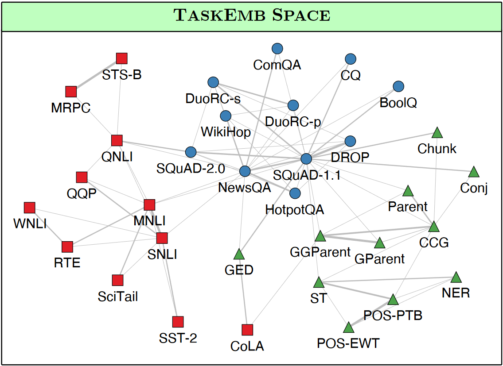

# T3P2 - Predicting OoD Generalisation for Intermediate Dataset Transfer
Datasets Processing: https://github.com/ioverho/emotion_datasets
Datasets: https://surfdrive.surf.nl/files/index.php/s/gnDwUL3ziBTiwy3
## Preamble

Emotion recognition has been a goal of artificial intelligence research since the very beginning of our field. Despite this, emotion classification on text remains out of reach. One source of frustration is the many different theoretical frameworks for emotion. Available datasets for emotion classification similarly use various, very different labelling systems, with little overlap between datasets (see \[1\], \[2\] or Table 1 in the datasets repo).

As a result, it's very difficult to test the generalisation of emotion classifiers across different datasets---the label space of the target dataset is completely different from datasets seen during training. 

Further reading:
1. Bostan, L. A. M., & Klinger, R. (2018). [An analysis of annotated corpora for emotion classification in text](https://aclanthology.org/C18-1179.pdf).
2. Al Maruf, A., Khanam, F., Haque, M. M., Jiyad, Z. M., Mridha, M. F., & Aung, Z. (2024). [Challenges and opportunities of text-based emotion detection: a survey. IEEE access, 12, 18416-18450](https://ieeexplore.ieee.org/stamp/stamp.jsp?tp=&arnumber=10409495).

## Project Description

In this project, instead of developing a new representation learner, we will be predicting the effectiveness of fine-tuning on an emotion dataset, before transferring to another downstream emotion dataset (i.e., intermediate dataset transfer). By doing so, we hope to discover structure within different datasets, and be able to predict which (types of) datasets serve as good pre-training corpora for other datasets.

OoD prediction techniques have recently seen much interest in cases where one wants to predict the performance of a model on a novel dataset, without having to evaluate the model on the entire dataset. This occurs when there is insufficient budget to train and evaluate the model, or when labels are not available.

One line of research uses gradient information to construct “Task Embeddings”. In this project, we will be using text and task embeddings to predict transfer performance between emotion labelling schemes.

Further Reading:
3. Achille, A., Lam, M., Tewari, R., Ravichandran, A., Maji, S., Fowlkes, C. C., ... & Perona, P. (2019). [Task2vec: Task embedding for meta-learning. In Proceedings of the IEEE/CVF international conference on computer vision (pp. 6430-6439).](https://arxiv.org/abs/1902.03545)
4. Vu, T., Wang, T., Munkhdalai, T., Sordoni, A., Trischler, A., Mattarella-Micke, A., ... & Iyyer, M. (2020). [Exploring and predicting transferability across NLP tasks. arXiv preprint arXiv:2005.00770.](https://aclanthology.org/2020.emnlp-main.635/)

## Starter Kit

Let's assume an emotion classifier consists of a text-encoder, $g(x;\theta)$, and a classification head $f(z;\phi)$, where $z$ are the outputs of $g$. We will use $\theta_{\mathcal{D}}$ and $\phi_{\mathcal{D}}$ to denote that the text-encoder and classification head were trained on a dataset $\mathcal{D}$. If the text-encoder was first trained on a *different* dataset ($\mathcal{D}_{j}$), before training the classification head on $\mathcal{D}_{i}$, we're talking about cross-dataset transfer fine-tuning.

Given some set of emotion datasets $\mathcal{D}_{i}\in \frak{D}$, which comes with some utility function $\mu(\hat{y}, y)$ (a measure of quality of the model's predictions, e.g., accuracy, F1, MCC, R2), we want to measure and predict the loss in utility incurred when transferring between datasets:
$$\mu(f(g(x;\theta_{\mathcal{D}_{j}});\phi_{\mathcal{D}_{i}}), y)-\mu(f(g(x;\theta_{\mathcal{D}_{i}});\phi_{\mathcal{D}_{i}}), y),~~i\not=j,(x,y)\sim \mathcal{D}_{i}$$
In a perfect world, where all datasets are comprehensive and contain high-quality texts, and all models generalize perfectly, this difference would be 0. Unfortunately, this is not the case: models do overfit to their training corpora. However, if the difference is *small*, it means that $\mathcal{D}_{j}$ is didactively useful for training models that generalize well to $\mathcal{D}_{i}$, and potentially to other datasets that lie out-of-distribution (OoD).

As said, we want to be able to predict this difference, based on the properties of the different datasets and models. The field of OoD generalisation prediction aims to do exactly this. Specifically, given some new, unseen dataset,
$$\underset{\mathcal{D}_{i}\in\mathfrak{D}}{\arg\max}~~\mu(f(g(x;\theta_{\mathcal{D}_{i}});\phi_{\mathcal{D}_{\text{unseen}}}), y),~~\mathcal{D}_{\text{unseen}}\not\in \mathfrak{D},(x,y)\sim \mathcal{D}_{\text{unseen}}$$
The field of OoD generalisation prediction is big. Two early techniques, however, might be useful for our case. Achille et al. in \[3\] and Vu et al. in \[4\] used an approximate Fisher information matrix for the same model trained on different datasets to create a task representation space. The theory was that models that lie close to each other in this representation space would transfer to each other better.
 

I posit that a similar relationship holds in emotion datasets. If two datasets have similar emotions in them, then the transfer between two datasets should be better than before. I propose using the same technique (task representations) per emotion class to try to predict which dataset would serve as a good intermediate finetuning dataset for other emotion datasets. Specifically, I want us to build a regression model as,
$$\mu(f(g(x;\theta_{\mathcal{D}_{j}});\phi_{\mathcal{D}_{i}}), y)\sim \Delta(\mathtt{task\_repr(\mathcal{D}_{i})}, \mathtt{task\_repr(\mathcal{D}_{j})})+\Delta(\mathtt{text\_repr(\mathcal{D}_{i})}, \mathtt{text\_repr(\mathcal{D}_{j})})$$
### Plan

#### Step 1: Explore Datasets & Choose Train/Test Subsets
Get the datasets set up (see above links), and explore the different emotions that are present. Try to create a train/test split that excludes some datasets entirely (preferably ones that have a similar emotion labelling scheme in the training data still), and excludes some emotion classes from datasets that are still in the training data. The validation set should be a uniform sample of data from the training datasets.
#### Step 2: Train Dataset-Specific Text Encoders
Finetune text encoders (i.e. a modern BERT variant) on the different datasets in isolation. During this fine-tuning stage, the parameters of the encoder, $g(x;\theta)$, should be fine-tuned as well.
#### Step 3: Transfer Dataset-Specific Text Encoders
Transfer the fine-tuned text encoders to the different datasets. During this second stage fine-tuning, the encoder paramaters, $g(x;\theta_{\mathcal{D}_j})$, should be kept frozen. These now encode information about the first fine-tuning dataset, $\mathcal{D}_{j}$.

Once fine-tuned, evaluate the model on the new dataset to get our values for:
$$\mu(f(g(x;\theta_{\mathcal{D}_{j}});\phi_{\mathcal{D}_{i}}), y)$$
For the prediction model, this will serve as the [endogenous variable](https://en.wikipedia.org/wiki/Exogenous_and_endogenous_variables) (i.e., the variable we'll be trying to predict).
#### Step 4: Construct Task and Text Representations
Use the task and text representations method discussed in Achille et al. in \[3\] and Vu et al. in \[4\] to create class-conditional representations for each emotion in each dataset. These should be constructed using the same text encoder, $g$, but with a classification head, $f$, fine-tuned on each dataset in isolation.

In practise, the task representations are constructed from the gradients of $g$ as: $\left(\nabla_{\theta}~g(x;\theta)\right)^2$. Without fine-tuning the classification head, the gradients will not be informative. During fine-tuning, of course, the parameters of $g$ should be frozen to ensure these are constant across different datasets.

Try to visualize these task representations using dimensionality reduction techniques (e.g., UMAP, T-SNE, PCA).
#### Step 5: Build Prediction Model
Compute the difference between different tasks using some distance (or similarity) function applied to different task and text embeddings. The differences between the representations of different tasks will serve as our [exogenous variable](https://en.wikipedia.org/wiki/Exogenous_and_endogenous_variables) (i.e., the variables we'll using for prediction).

Using this, we'll try to build a good regression model to predict the generalisability loss. The model will likely also need some additional variables (like mean dataset performance, dataset size). Feel free to suggest other interesting variables you think might correlate well with transferability.
## Deadlines
- 19 May, 23:59, \[Optional\] Report draft (only for feedback, ungraded)
- 23 May, 13:00, Poster presentation session (10% of course grade)
- 26 May, 23:59, Research report (40% of course grade)
## Meeting Minutes
\[Optional\] You can write down discussion points for our meetings, or simply track your progress here.

### Weeks 1+2 (April 21 - May 4)

Progress made this week:
- …

Discussion points:
- …

Goals for the next meeting:
- …
### Week 3 (May 5 - May 11)

Progress made this week:
- …

Discussion points:
- …

Goals for the next meeting:
- …
### Week 4 (May 12 - May 18)

Progress made this week:
- …

Discussion points:
- …

Goals for the next meeting:
- …
### Week 5 (May 19 - May 25)

Progress made this week:
- …

Discussion points:
- …